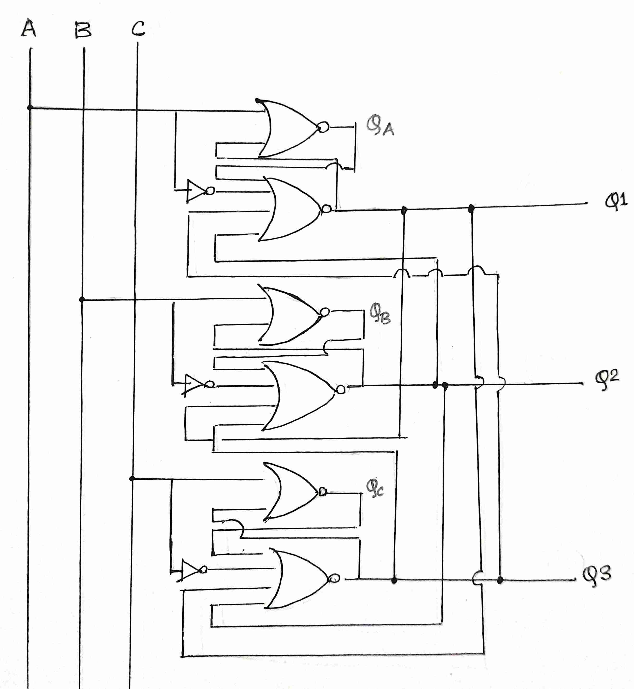

# Design and Implementation of Combinational Logic Based Electronic Buzzer Circuit using CMOS
This repository contains the design for a CMOS digital combinational logic based electronic buzzer circuit that selects the output basedon  the relative time of application of input, implemented using Synopsys Custom Compiler on 28nm CMOS technology


# Table of Contents
   * [Abstract](#abstract)
  * [Reference Circuit Details](#reference-circuit-details)
  * [Reference Circuit Diagram](#reference-circuit-diagram)
  * [Reference Circuit Waveforms](#reference-circuit-waveforms)
- [Simulation in Synopsys](#simulation-in-synopsys)
  * [Schematic](#schematic)
  * [Symbol](#symbol)
  * [Parameters set for Voltage Source for inputs](#parameters-set-for-voltage-source-for-inputs)
  * [Parameters set for DC Voltage Source for VDD](#parameters-set-for-dc-voltage-source-for-vdd)  
  * [Transient Settings](#transient-settings)
  * [Netlist](#netlist)
  * [Output Waveforms](#output-waveforms)
  * [Explanation for Observed Waveforms](#explanation-for-observed-waveforms)
  * [Conclusion](#conclusion)
  * [Acknowledgement](#acknowledgement)
  * [References](#references)


## Abstract

Design for a CMOS digital combinational logicbased electronic buzzer circuit that selects the output based
on the relative time of application of input. There are three
independent digital input points, corresponding to which there
are three outputs. The output corresponding to the first applied
input becomes high from an initial low state and remains stable
at that state, unaffected by any change in input signals from the
other two input points. The output returns to its initial low state
only when the first input signal is removed. The circuit is purely
combinational as the outputs are independent of any clock signal. 

## Reference Circuit Details

The electronic buzzer circuit selects the output corresponding to the the input applied first. The other two inputs become
don’t cares, and do not affect the output until the first input
signal becomes low again. The proposed circuit utilizes the
properties of ’D-type Latch’, also called transparent latch,
without using the enable. The latch circuit composed of NOR
gates and NOT gates, is slightly modified to meet the design
requirements.
Fig. 3 represents the digital combinational logic design of
the circuit using NOR and NOT gates. Fig. 1 and Fig. 2
represent the NOR and NOT gates using CMOS circuit which
is comprised of two parts - the pull-up lattice composed of
PMOS circuit and the pull-down lattice composed of NMOS
circuit. PMOS circuit is connected to supply voltage VDD
and NMOS circuit is connected to Ground terminal. Fig. 4
represents the various output waveforms. The inputs are taken
as A, B and C with outputs as Q1, Q2 and Q3 corresponding
to the respective inputs.
Q1 = (A’+QA+B+C)’,
Q2 = (B’+QB+A+C)’,
Q3 = (C’+QC+A+B)’ 

## Reference Circuit Diagram
<p align="center">
</br>
  Fig. 1:  Reference Combinational logic circuit design.
 <p align="center">
 </br>
  Fig. 2:  CMOS 2 input NOT Gate
 <p align="center">
 </br>
  Fig. 3:  CMOS 4 input NOR Gate
</p>

## Reference Circuit Waveforms
<p align="center">
</br>
  Fig. 4:  Waveforms
</p>

# Simulation in Synopsys
## Schematic


  Figs. 5(i), (ii), (iii), (iv), (v), (vi): Final simulated circuit.
</p>
Note: To make the circuit symbols more understandable, the magnified images of the symbols(along with their internal designs) have been provided alongside the actual design.


## Symbol
  


   Fig. 6(i): NOR_2 symbol   


   Fig. 6(ii): NOR_2 schematic
   
   
 

    Fig. 7(i): NOT_2 symbol  
   


    Fig. 7(ii): NOT_2 schematic
        


 Fig. 8(i): NOR_4 symbol
    

    <p align="center">
Fig. 8(ii): NOR_4 schematic
    
    
  </p>
Note: To make the CMOS Level circuit more compatible and Industry ready a Symbol reference has been created. So, it makes easy whenever a testbench of different Parameters needs to be tested.

## Parameters set for Voltage Source for inputs


 <p align="center">
  Fig. 9(i): Voltage Source Input at A.
  </p>
  


<p align="center">
  Fig. 9(ii): Voltage Source Input at B.
  </p>


<p align="center">
Fig. 9(iii): Voltage Source Input at C.  

</p>

## Parameters set for DC Voltage Source for VDD

<p align="center">
  Fig. 10: VDD Supply voltage
</p>


## Transient Settings

<p align="center">
  Fig. 11: The Transient Analysis Inputs run at 1us step with stop time 100us 
</p>

## Netlist
```
*  Generated for: PrimeSim
*  Design library name: my_design
*  Design cell name: design
*  Design view name: schematic
.lib 'saed32nm.lib' TT

*Custom Compiler Version S-2021.09
*Wed Feb 23 19:46:53 2022

.global gnd!
********************************************************************************
* Library          : my_design
* Cell             : NOR_2
* View             : schematic
* View Search List : hspice hspiceD schematic spice veriloga
* View Stop List   : hspice hspiceD
********************************************************************************
.subckt nor_2 net2 net9 net12 net16 net27
xm5 net31 net27 net9 net31 p105 w=0.654u l=0.03u nf=1 m=1
xm0 net31 net12 net2 net2 p105 w=0.654u l=0.03u nf=1 m=1
xm4 net16 net27 net9 net16 n105 w=0.518u l=0.03u nf=1 m=1
xm2 net9 net12 net16 net16 n105 w=0.518u l=0.03u nf=1 m=1
.ends nor_2

********************************************************************************
* Library          : my_design
* Cell             : NOR_4_1
* View             : schematic
* View Search List : hspice hspiceD schematic spice veriloga
* View Stop List   : hspice hspiceD
********************************************************************************
.subckt nor_4_1 net4 net5 net14 net15 net18 net21 net22
xi4 net18 net21 net48 net22 net53 nor_2
xi3 net18 net53 net51 net22 net51 nor_2
xi2 net18 net51 net14 net22 net15 nor_2
xi1 net18 net48 net50 net22 net50 nor_2
xi0 net18 net50 net4 net22 net5 nor_2
.ends nor_4_1

********************************************************************************
* Library          : my_design
* Cell             : NOT_2
* View             : schematic
* View Search List : hspice hspiceD schematic spice veriloga
* View Stop List   : hspice hspiceD
********************************************************************************
.subckt not_2 net9 net12 net13 net14
xm1 net9 net14 net13 net9 n105 w=0.518u l=0.03u nf=1 m=1
xm2 net13 net14 net12 net12 p105 w=1.06u l=0.03u nf=1 m=1
.ends not_2

********************************************************************************
* Library          : my_design
* Cell             : design
* View             : schematic
* View Search List : hspice hspiceD schematic spice veriloga
* View Stop List   : hspice hspiceD
********************************************************************************
xi4 net70 net50 net84 net71 net81 net25 gnd! nor_4_1
xi3 net46 net84 net25 net24 net81 net50 gnd! nor_4_1
xi0 net42 net50 net8 net25 net81 net84 gnd! nor_4_1
xi5 net81 net71 net25 gnd! net74 nor_2
xi2 net81 net24 net50 gnd! net49 nor_2
xi1 net81 net8 net84 gnd! net85 nor_2
xi9 gnd! net81 net70 net74 not_2
xi7 gnd! net81 net42 net85 not_2
xi8 gnd! net81 net46 net49 not_2
v10 net81 gnd! dc=1.2
c15 net84 gnd! c=1p
c14 net25 gnd! c=1p
c13 net50 gnd! c=1p
v23 net49 gnd! dc=0 pat ( 1.2 0 0 0.1u 0.1u 5u b001001110010 )
v22 net85 gnd! dc=0 pat ( 1.2 0 0 0.1u 0.1u 5u b011100100010 )
v24 net74 gnd! dc=0 pat ( 1.2 0 0 0.1u 0.1u 5u b000100100111 )


.tran '1u' '100u' name=tran

.option primesim_remove_probe_prefix = 0
.probe v(*) i(*) level=1
.probe tran v(net25) v(net49) v(net50) v(net74) v(net84) v(net85)

.temp 25


.option primesim_output=wdf


.option parhier = LOCAL


.end

```
## Output Waveforms


  Fig. 12: Required Simulation Waveforms 
  
  Note: The 1st 3 waveforms are the inputs A, B, and C respectively, while the last 3 are the outputs Q1, Q2, and Q3 respectively, which is same as depicted in above hand-drawn wavform.
</p>

## Explanation for Observed Waveforms


## Conclusion
Thus, the observed output waveforms match perfectly with our hand drawn output waveforms, for the required set of inputs. Hence, our required design for CMOS digital combinational logic based electronic buzzer circuit that selects the output based on  the relative time of application of input, has been implemented and verified using Synopsys Custom Compiler on 28nm CMOS technology


## Acknowledgement
1. Kunal Ghosh, Co-founder, VSD Corp. Pvt. Ltd. - kunalpghosh@gmail.com
2. Chinmay panda, IIT Hyderabad
3. Sameer Durgoji, NIT Karnataka
4. Synopsys Team/Company
5. https://www.iith.ac.in/events/2022/02/15/Cloud-Based-Analog-IC-Design-Hackathon/

## References
[1] Balraj Singh, Mukesh Kumar, and J. S. Ubhi, “Analysis of CMOS based
NAND and NOR Gates at 45mm Technology”, IJEECS, ISSN 2348-
117X, Volume 6, Issue 4, April 2017.
[2] Sudhakar Alluri1, Uma Umaheshwar, B. Rajendra Naik and
N.S.S.Reddy, “Design and Performance Analysis of VLSI Circuits in
180nm Technology”, IJCRT, ISSN: 2320-2882, Volume 6, Issue 2 April
2018


